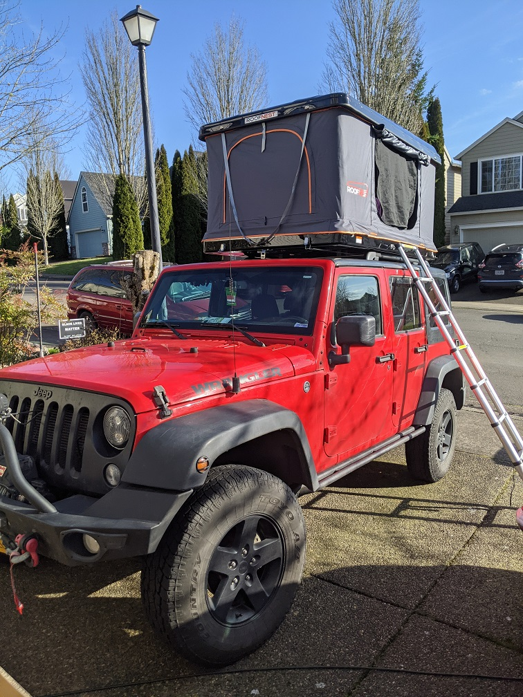
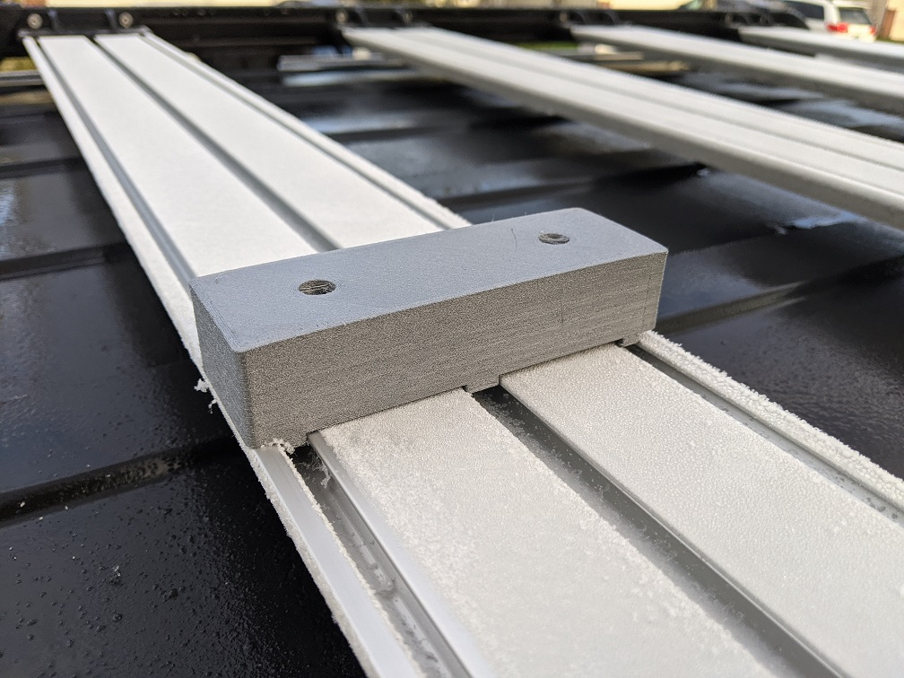
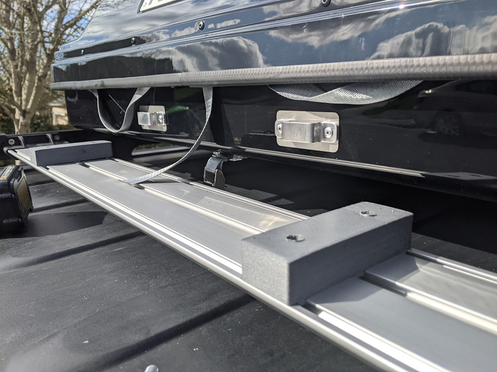
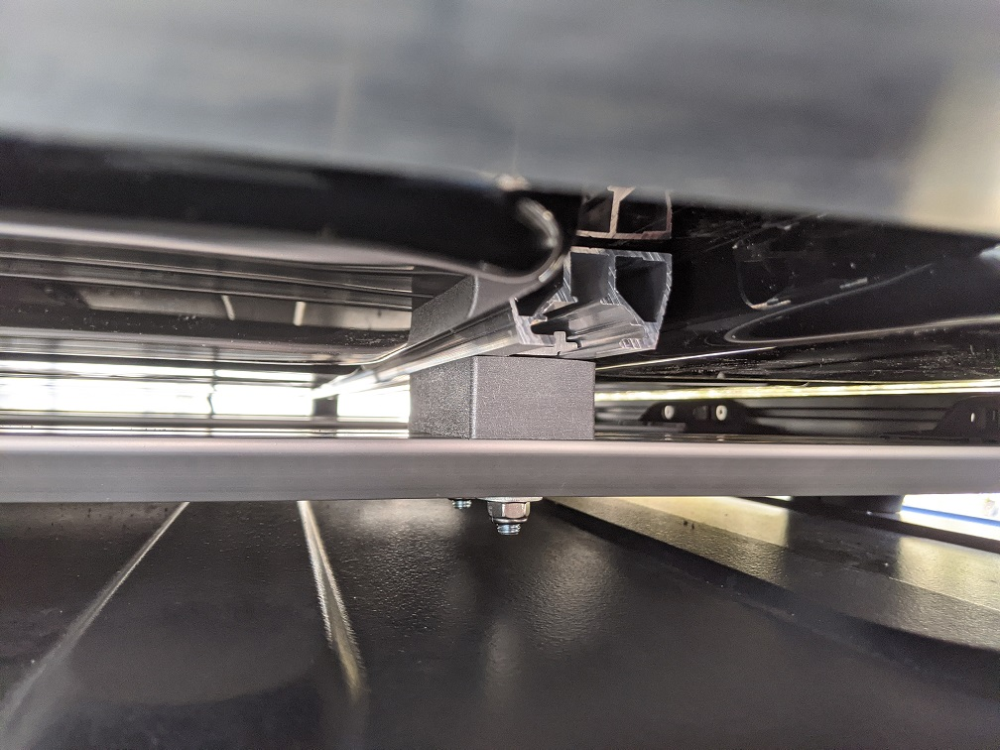
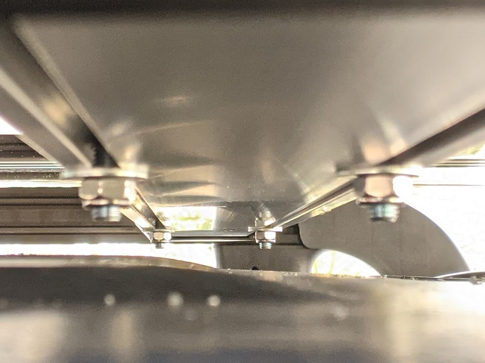

# Spacers for Installing Roof Top Tent on TeraFlex Nebo Roof Rack

## Introduction
The [TeraFlex Nebo roof rack](https://teraflex.com/shop_items/jk-nebo-roof-rack-black) is one of the options for installing a roof top tent (RTT) on your Jeep.
It has a slick look, and sturdy enough to support the tent, including the bedding and other gear stored in the tent.
Unfortunately the top of slats (crossbars) of this rack are an inch lower than the top of the roof rack rails. The spacers described here are mounted on the top of the slats,
and then the roof top tent is mounted on the top of them, using bolts going through the slats and spacers.
The spacers were designed to install Roofnest Sparrow tent. They can be used with other roof top tents too.

## Prerequisites - Tools, parts, and supplies

* Tools
  * 3D printer
  * Electric drill
  * 9 mm (or 5/16") drill bit
  * 13 mm ratcheting wrench
  * Tape measure
  * Permanent marker
* Supplies and Parts
  * PETG filament for printer
  * Eight (8) [M8-1.25 x 60 mm Hex Bolts](https://www.homedepot.com/p/Everbilt-M8-1-25-x-60-mm-Class-8-8-Zinc-Plated-Hex-Bolt-801728/204273673)

## Printing Spacers

Using a 3D printer, print four (4) spacers, using provided [Spacer.stl](https://github.com/skiselev/teraflex-nebo-rtt/blob/main/printed_parts/Spacer.stl) file.

The following settings are recommended:
* Layer height: 0.2 mm
* Infill pattern: Gyroid
* Infill density: 60%

## Installation

### Step 1
Install TeraFlex Nebo roof rack following the manufacturers instructions. Install at least two slats, one closer to the front of the rack, and one closer to the back.

### Step 2
Using the tape measure, measure the distance between mounting rails of the tent

### Step 3
Measure and mark the location of the spacers on the slats. Place spacers. The distance between center holes of the spacers should be the same as the distance between tent's mounting rails

 

### Step 4
Double check the measurements. At this stage, you might want to put the tent on the spacers and the roof rack to make sure that it fits well and mounting rails sit on the spacers.

### Step 5
Drill 9 mm (or 5/16") holes through the slats, using the holes in the spacers as a guide

### Step 6
Put M8 bolts in the aluminum mounting plates provided with the tent.
Insert the plates into the tent's mounting rails, two plates (4 bolts) in each rail

### Step 7
Put the tent on the top of the roof rack, and move the plates with the bolts so that the bolts go through the holes in the spacers and the slats, lifting the tents corners as needed

### Step 8
Secure the tent with nuts using 13 mm wrench. Tighten.

